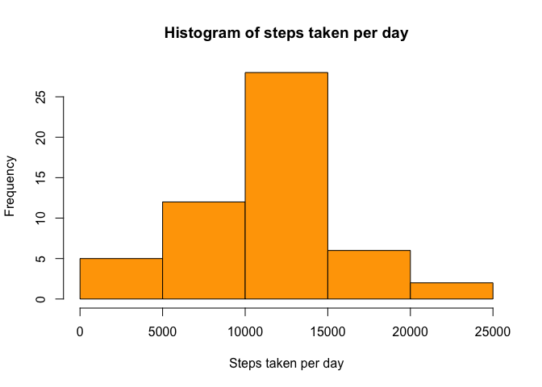
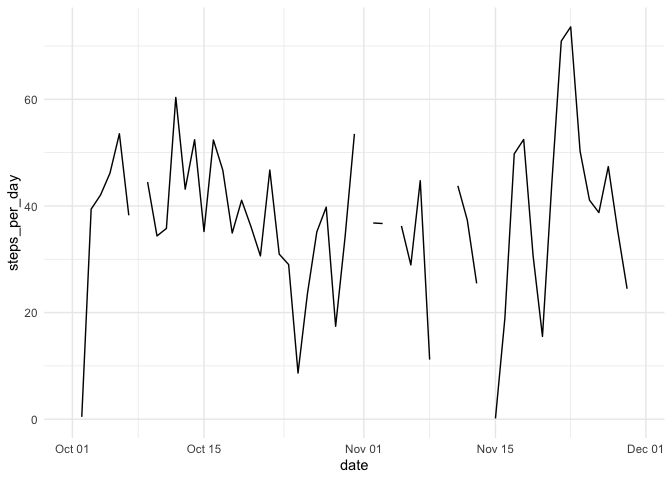
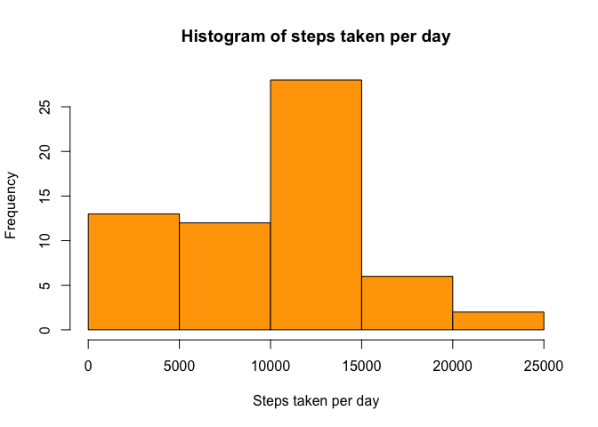

### Importing data


```r
data <- read.csv("activity.csv")
dim(data)
```

```
## [1] 17568     3
```

```r
head(data)
```

```
##   steps       date interval
## 1    NA 2012-10-01        0
## 2    NA 2012-10-01        5
## 3    NA 2012-10-01       10
## 4    NA 2012-10-01       15
## 5    NA 2012-10-01       20
## 6    NA 2012-10-01       25
```

## Steps taken per day


```r
steps <- data %>% 
  group_by(date) %>% 
  summarise(steps_per_day = sum(steps))
```

```
## `summarise()` ungrouping output (override with `.groups` argument)
```

```r
head(kable(steps),10)
```

```
##  [1] "date          steps_per_day" "-----------  --------------"
##  [3] "2012-10-01               NA" "2012-10-02              126"
##  [5] "2012-10-03            11352" "2012-10-04            12116"
##  [7] "2012-10-05            13294" "2012-10-06            15420"
##  [9] "2012-10-07            11015" "2012-10-08               NA"
```

## Histogram of number of steps taken per day

```r
hist(steps$steps_per_day, breaks = 5, col = "orange",
     xlab = "Steps taken per day", main = "Histogram of steps taken per day")
```

<!-- -->


## Mean and Median steps taken per day

```r
Mean <- mean(steps$steps_per_day, na.rm = TRUE)
Median <- median(steps$steps_per_day, na.rm = TRUE)
```

### 1.0766\times 10^{4} is the mean number of steps taken per day and 10765 is the median number of steps taken per day  
  
  
## Time series plot


```r
data$date <- as.Date(data$date)

data %>% 
  group_by(date) %>% 
  summarise(steps_per_day = mean(steps, na.rm = TRUE)) %>% 
  filter(steps_per_day != "NA") %>% 
  ggplot(aes(date, steps_per_day)) +
  geom_line() +
  theme_minimal()
```

```
## `summarise()` ungrouping output (override with `.groups` argument)
```

```
## Warning: Removed 2 row(s) containing missing values (geom_path).
```

<!-- -->


```r
data$interval<-factor(data$interval)
act <-aggregate(data=data,steps~date+interval,FUN="mean")
act1 <-aggregate(data=act,steps~interval,FUN="max")
head(kable(act1),10)
```

```
##  [1] "interval    steps" "---------  ------" "0              47"
##  [4] "5              18" "10              7" "15              8"
##  [7] "20              4" "25             52" "30             28"
## [10] "35             46"
```


## Imputing Missing data

```r
Imputed <- caret::preProcess(data, "medianImpute")
imputed_data <- predict(Imputed, data)
```

## Histogram after Imputation


```r
Im_data <- imputed_data %>% 
  group_by(date) %>% 
  summarise(steps = sum(steps))
```

```
## `summarise()` ungrouping output (override with `.groups` argument)
```

```r
hist(Im_data$steps, breaks = 5, col = "orange",
     xlab = "Steps taken per day", main = "Histogram of steps taken per day")
```

<!-- -->

